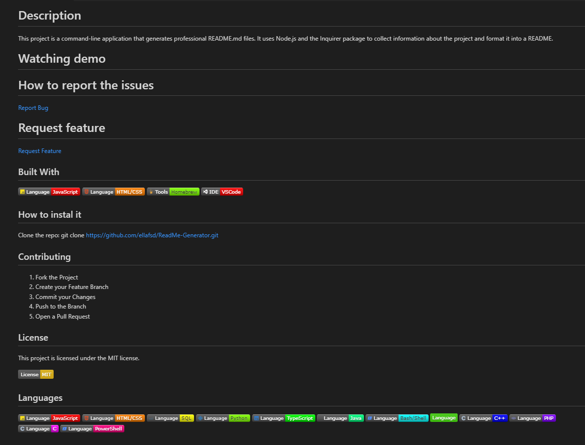

# Description
This project is a command-line application that generates professional README.md files. It uses Node.js and the Inquirer package to collect information about the project and format it into a README.

# Table of Contents

# Watching demo
https://drive.google.com/file/d/1afB1sI38fTc0qiq9kE6G3UJuynxhw6ct/view?usp=sharing

# How to report the issues 
<a href="https://github.com/ellafsd/ReadMe-Generator">Report Bug</a>

 
# Request feature
<a href="https://github.com/ellafsd/ReadMe-Generator">Request Feature</a>
  

## Built With

## How to instal it

Clone the repo:  git clone https://github.com/ellafsd/ReadMe-Generator.git

## Contributing

1. Fork the Project
2. Create your Feature Branch 
3. Commit your Changes 
4. Push to the Branch 
5. Open a Pull Request

## License

This project is licensed under the MIT license.

## Languages

